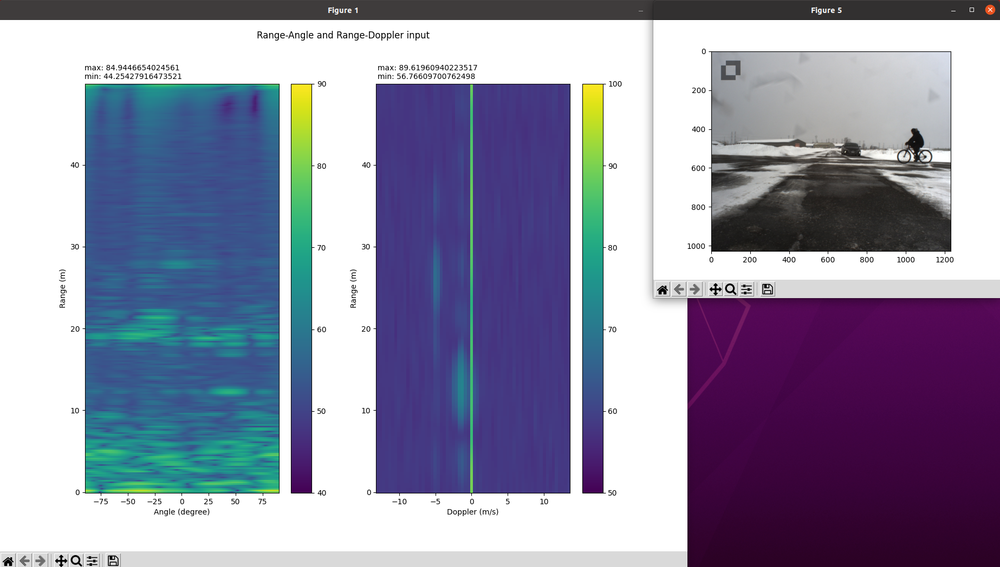
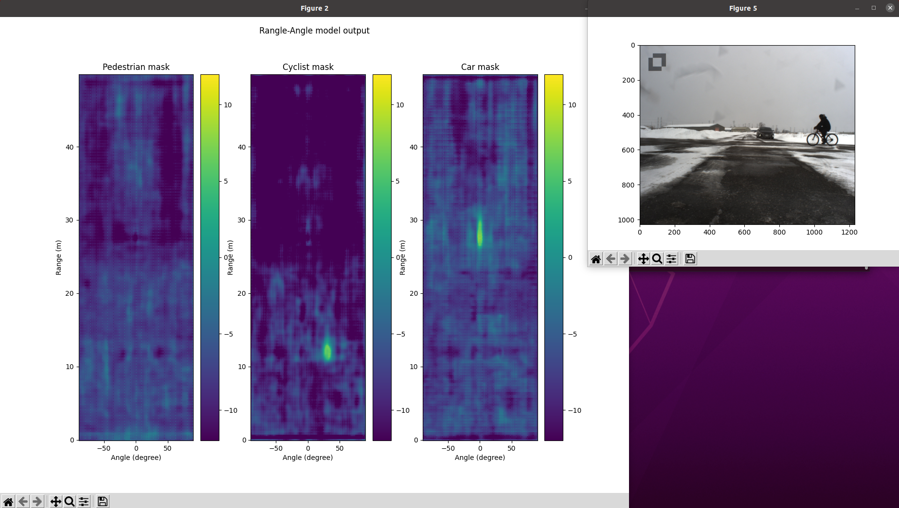
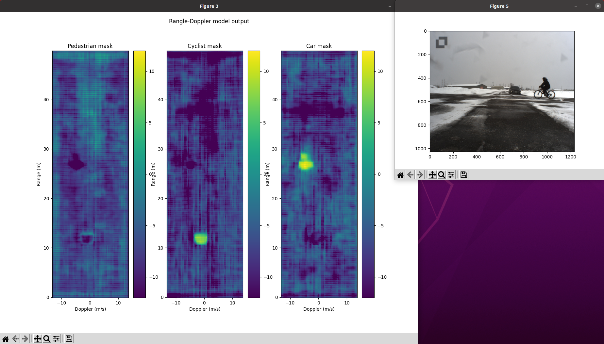
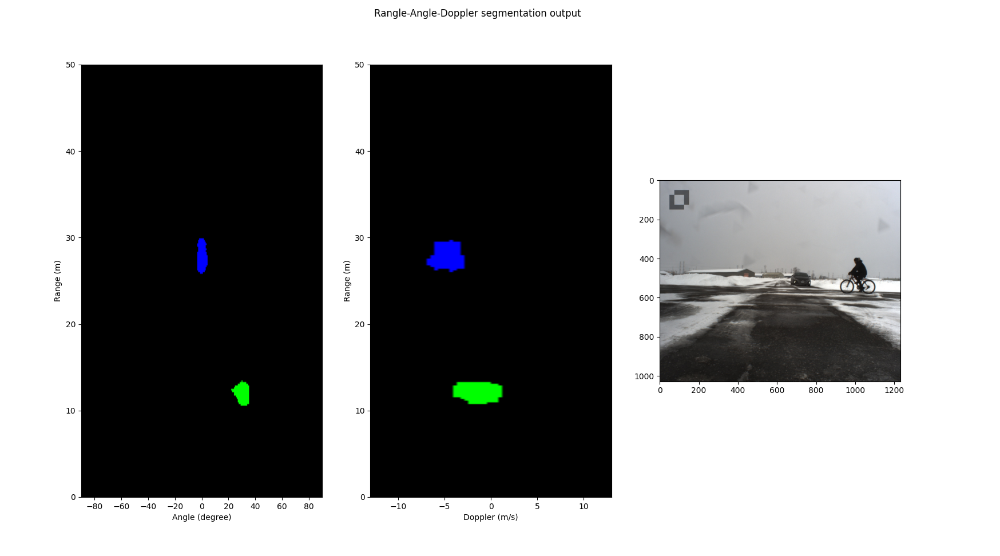

# Multi-View Radar Semantic Segmentation

## Paper


[Multi-View Radar Semantic Segmentation](https://arxiv.org/abs/2103.16214), ICCV 2021.

[Arthur Ouaknine](https://arthurouaknine.github.io/), [Alasdair Newson](https://sites.google.com/site/alasdairnewson/), [Patrick Pérez](https://ptrckprz.github.io/), [Florence Tupin](https://perso.telecom-paristech.fr/tupin/), [Julien Rebut](https://scholar.google.com/citations?user=BJcQNcoAAAAJ&hl=fr)

This repository groups the implemetations of the MV-Net and TMVA-Net architectures proposed in [the paper of Ouaknine *et al.*](https://arxiv.org/abs/2103.16214).

The models are trained and tested on the [CARRADA dataset](https://arxiv.org/abs/2005.01456).

The CARRADA dataset is available on Arthur Ouaknine's personal web page at this link: [https://arthurouaknine.github.io/codeanddata/carrada](https://arthurouaknine.github.io/codeanddata/carrada).

If you find this code useful for your research, please cite [our paper](https://arxiv.org/abs/2103.16214):
```
@InProceedings{Ouaknine_2021_ICCV,
	       author = {Ouaknine, Arthur and Newson, Alasdair and P\'erez, Patrick and Tupin, Florence and Rebut, Julien},
	       title = {Multi-View Radar Semantic Segmentation},
	       booktitle = {Proceedings of the IEEE/CVF International Conference on Computer Vision (ICCV)},
	       month = {October},
	       year = {2021},
	       pages = {15671-15680}
	       }
```

## Input interpretation
Input of the model (TMVA) contains of 3 multi-views. In which, range-angle and range-Doppler are main inputs, while angle-Doppler acts as an additional. The below image shows the range-angle and range-Doppler as images. For interpretation, the axes of the plots have been converted into real unit (range-meter, angle-degree, Doppler-m/s).

According to the figure 1, there are 2 plots from range-angle (left) and range-Doppler (right). The pixel position will tell us the range, angle and Doppler info of the signal, while pixel intensity is the log transformed real value of the Radar signal after being transformed by FFT.

## Result interpretation
The result of the model can be divided into two phases. The real value mask directly from the model output and the maximum likelihood mask.


The above images show the real value mask of range-angle and range-Doppler. In each figure 1, there are 3 plots show masks for each class (Pedestrian, Cyclist and Car). The pixel position works the same as in the input while the pixel intensity shows how likely the pixel belong to each class. If a pixel belong to a class (have large value in one class mask), the corresponding pixel in other masks will become really small to show the transistion between classes.   

In this second phase output, the pixel values are converted into color code to show which class it's belong to (black-background, red-pedestrian, green-cyclist, blue-car). The pixel position works the same way as usual.

## License

The MVRSS repo is released under the Apache 2.0 license.
